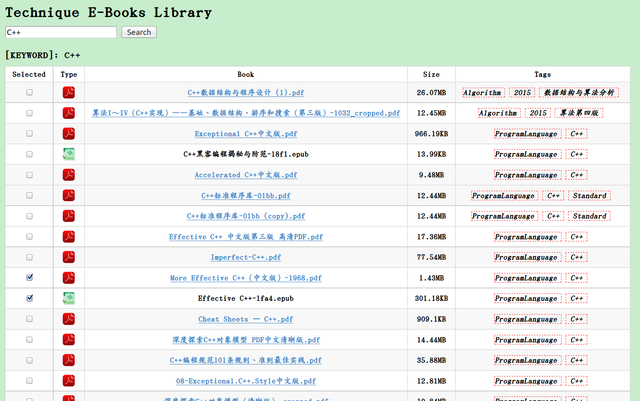

# Online Viewer
## Introduction
A simple online library implementation developed with `php`.
Build an online pdf view with `pdfjs` and search file by `find`. 
## Dependency
```
pdfjs
```
## Snapshot


## Just a demo
<iframe height=500 width=500 src="./library.gif">


## TODO FUNCTION
- SLECT ALL
- NGNIX CONFIG 
- RECORD CLIENT IP
- RECOMMENDATION
 

